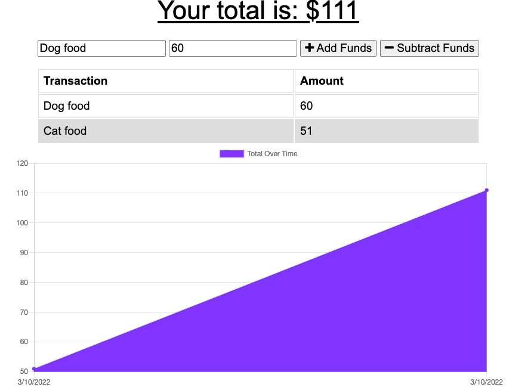

 

   

  # budget-tracker

  ## Description 
  The budget-tracker allows users to track expenses and deposits online and offline. 

  
  ## Table of Contents

  * [Installation](#Installation)
  * [Usage](#Usage)
  * [Contributions](#Contributions)
  * [Testing](#Testing)
  * [License](#License)
  * [Questions](#Questions)

  ## Installation
  Open link to deployed application.

  ## Usage
  To track transactions offline and online.

  ## Contributions
  N/A

  ## Testing 
  No tests necessary.

  ## License 
  This project has an MIT license.
  https://opensource.org/licenses/MIT

 
  

  ## Questions
  Need to reach me?
  * Email: michevalenz27@gmail.com
  * [GitHub](https://github.com/MichValenz/budget-tracker)

       